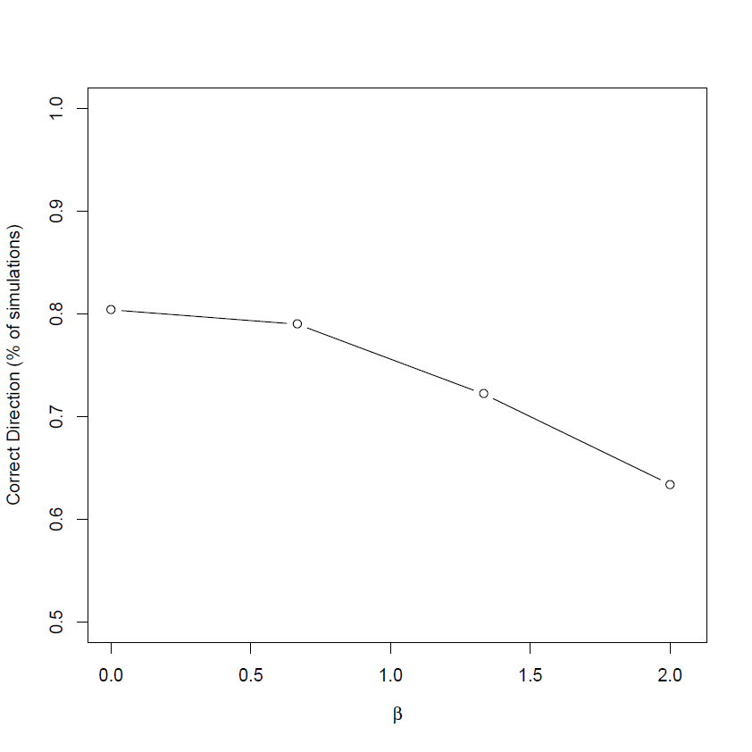

# reverseDirection
Examines the MR Steiger approach to detect the directionality between the mediator and outcome through simulation studies

## Installation
```
# you need R v3.4 or higher
install.packages("devtools")  # devtools must be installed first
install.packages("MendelianRandomization") 
install.packages("psych")
devtools::install_github("MRCIEU/TwoSampleMR") 

devtools::install_github("SharonLutz/reverseDirection")
```

## Input
nSNP is the number of SNPs generated from a binomial distribution for n subjects (input n) for a given minor allele frequency (input vector MAF).

For the SNPs Xi, the mediator/ exposure M is generated from a normal distribution with the variance (input varM) and the mean as follows:

E\[M<sub>i</sub> \] = &gamma;<sub>o</sub> + &sum; &gamma;<sub>X</sub>  X<sub>i</sub> 

All of these values are inputted by the user (i.e. the intercept gamma0, and the genetic effect size as a vector gammaX).

The outcome Y is generated from a normal distribution with the variance (input varY) and the mean as follows:

E\[Y<sub>i</sub> \] = &beta;<sub>o</sub> +  &beta;<sub>M</sub> M<sub>i</sub>  

All of these values are inputted by the user (i.e. the intercept beta0 and the effect of the mediator directly on the outcome as betaM).

If there is pleiotropy (input Uconfounder =T), then an additional covariate U is gernerated from a normal distribution with a variance (input varU) and a mean such that

E\[U<sub>i</sub> \] = &delta;<sub>o</sub> + &sum; &delta;<sub>X</sub>  X<sub>i</sub> 

Then, the mediator is generated as defined above, but the outcome Y is generated from a normal distribution such that
E\[Y<sub>i</sub> \] = &beta;<sub>o</sub> +  &beta;<sub>M</sub> M<sub>i</sub>   +  &beta;<sub>U</sub> U<sub>i</sub> 

After the SNPs X, mediator M, and outcome Y are generated, then the reverseDirection function runs the MR Steiger approach to determine if the mediator M causes the outcome Y.

## Output

## Example:
Consider an example with 100 subjects (input n=100) for one SNP (input nSNP = 1) with a MAF of 50% (input MAF=0.5). Consider a pleiotropic effect (input Uconfounder =T). Then, let the mediator M be generated from a normal distribution with a variance of 1 (input varM = 1) and mean such that 
E\[M<sub>i</sub> \] = 0 + 0.4 X<sub>i</sub> 
(input gamma0 = 0, gammaX 0.4). The covariate U is generated from a normal distribution with a variance of 1 (input varU = 1) and mean such that 
E\[U<sub>i</sub> \] = 0 + 0.25 X<sub>i</sub> 
(input delta0 = 0, deltaX = 0.25). The outcome Y is generated from a normal distribution with a variance of 1 (input varU = 1) and mean such that 
E\[Y<sub>i</sub> \] = 0 + &beta;<sub>M</sub> X<sub>i</sub> +0.25 U<sub>i</sub>
(input beta0 = 0, betaU = 0.25) and &beta;<sub>M</sub> varies from 0 to 1 by 0.25 (input betaM =seq(from = 0, to = 1, by=0.25)). The R code to run this example is given below

```
library(reverseDirection)

reverseDirection(nSim =1000, n = 100, nSNP = 1, MAF = 0.5, gamma0 = 0, gammaX 0.4, varM = 1, 
beta0 = 0, betaM =seq(from = 0, to = 1, by=0.25) , varY = 0.2, delta0 = 0, deltaX = 0.25, 
varU = 1, gammaU = 0, betaU = 0.25, Uconfounder =T, alpha = 0.05, SEED = 1, 
plot.pdf = T, plot.name = "plotMRdirection.pdf")

```


## Output:



