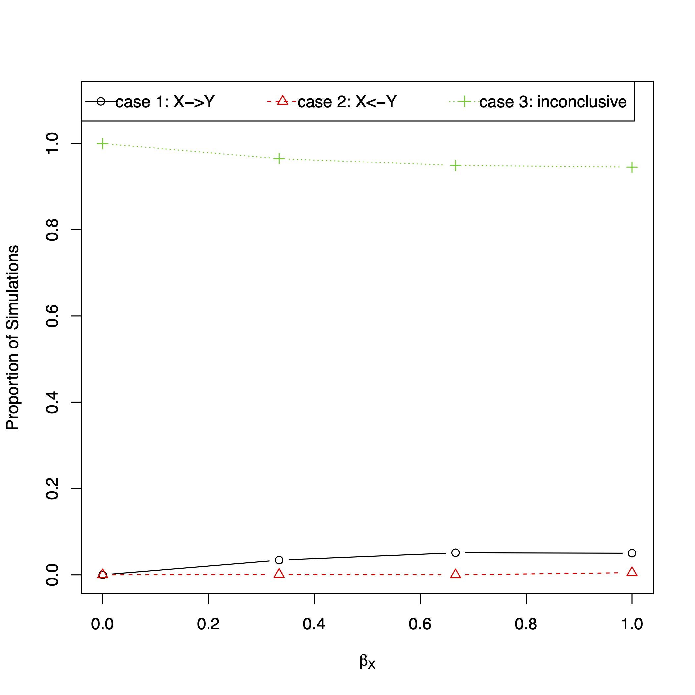

# reverseDirection
Examines the MR Steiger approach to detect the directionality between the exposure X and outcome Y through simulation studies.

## Installation
```
install.packages("devtools")  # devtools must be installed first, R v3.4 or higher is needed
install.packages("psych")

devtools::install_github("SharonLutz/reverseDirection")
```

## Input
First, the SNP is generated from a binomial distribution for n subjects (input n) for a given minor allele frequency (input MAF).

For the SNP G, the true exposure (X<sub>true</sub>) is generated from a normal distribution with the variance (input varX) and the mean as follows:

E\[Xtrue \] = &gamma;<sub>o</sub> + &gamma;<sub>G</sub> G

All of these values are inputted by the user (i.e. the intercept gamma0, and the genetic effect size gammaG). If there is no measurement error (measurementError==F), then X=X<sub>true</sub>. If there is measurement error (measurementError==T), then the measured exposure X is generated from the true exposure X<sub>true</sub> such that

E\[X \] = &delta;<sub>o</sub> + &delta;<sub>X</sub> X<sub>true</sub>

where &delta;<sub>o</sub> and &delta;<sub>X</sub> are inputted by the user. The outcome Y is generated from a normal distribution with the variance (input varY) and the mean as follows:

E\[Y \] = &beta;<sub>o</sub> +  &beta;<sub>X</sub> X

if there is no pleiotropy (input pleiotropy=F). If there is pleiotropy (input pleiotropy=T), then the outcome Y is generated such that

E\[Y \] = &beta;<sub>o</sub> +  &beta;<sub>X</sub> X + &beta;<sub>G</sub> G

All of these values are inputted by the user (i.e. the intercept beta0 and the effect of the exposure directly on the outcome as  &beta;<sub>X</sub>).

After the SNP G, exposure X, and outcome Y are generated, then the reverseDirection function runs the MR Steiger approach to determine if the exposure X causes the outcome Y.

## Output
This function outputs the percent of simulations where the correct direction is detected between the exposure X and outcome Y using the MR Steiger approach. The R functions outputs the percent of simulations where the 3 cases are detected:

### case 1: X->Y if the p-value from the Steiger corrrelation is less than alpha and p-value from the MR approach is less than alpha and the steiger correlation Z>0
### case 2: X<-Y if the p-value from the Steiger corrrelation is less than alpha and p-value from the MR approach is less than alpha and the steiger correlation Z<0
### case 3: inconclusive if the p-value from the Steiger corrrelation is greater than alpha or the p-value from the MR approach is greater than alpha 

The percent of simulations where p-value from the Steiger correlation and MR are less than alpha are outputted (Steiger and MR, respectively). The correlation between the SNP G and the exposure X (corGX), correlation between the SNP G and the outcome Y (corGY), and the correlation between the exposure X and the outcome Y (corXY).

## Example:
Consider an example with 100 subjects (input n=100) for one SNP (input nSNP = 1) with a MAF of 50 (input MAF=0.5). Consider a pleiotropic effect (input Uconfounder =T). Then, let the mediator M be generated from a normal distribution with a variance of 1 (input varM = 1) and mean such that 
E\[M \] = 0 + 0.4 X
(input gamma0 = 0, gammaX 0.4). The covariate U is generated from a normal distribution with a variance of 1 (input varU = 1) and mean such that 
E\[U \] = 0 + 0.25 X
(input delta0 = 0, deltaX = 0.25). The outcome Y is generated from a normal distribution with a variance of 1 (input varU = 1) and mean such that 
E\[Y \] = 0 + &beta;<sub>M</sub> X +0.25 U
(input beta0 = 0, betaU = 0.25) and &beta;<sub>M</sub> varies from 0 to 1 by 0.25 (input betaM =seq(from = 0, to = 1, by=0.25)). The R code to run this example is given below.

```
library(reverseDirection)

results<-reverseDirection(nSim = 1000, n = 100, MAF = 0.5, gamma0 = 0, gammaG = 0.4, varX = 1, 
measurementError = F, delta0 = 0, deltaX = 0.25, varME = 1, 
beta0 = 0, betaX = seq(from = 0, to = 1, length.out = 4), pleiotropy = F, betaG = 0.25, varY = 0.2, 
sig.level = 0.05, SEED = 1, plot.pdf = T, plot.name = "reverseDirection.pdf")

round(results$matrix,2)
```

The function outputs the following matrix and plot where each row corresponds to betaM. As seen below, when the association between M and Y increases in the presence  of pleiotropy, the direction of the arrow between the mediator M and the outcome Y  is only detected 44% of the time (as shown in row 5 column CorrectDirection in the matrix and the plot).
```
     case1 case2 case3   Z+ CorrectDirection Steiger   MR corGX corGY corXY
[1,]  0.00     0  1.00 0.95             0.95    0.27 0.06  0.27  0.00  0.00
[2,]  0.03     0  0.96 0.90             0.90    0.20 0.41  0.28  0.17  0.61
[3,]  0.05     0  0.95 0.77             0.77    0.13 0.62  0.27  0.23  0.84
[4,]  0.05     0  0.94 0.72             0.72    0.10 0.72  0.27  0.25  0.92
```


