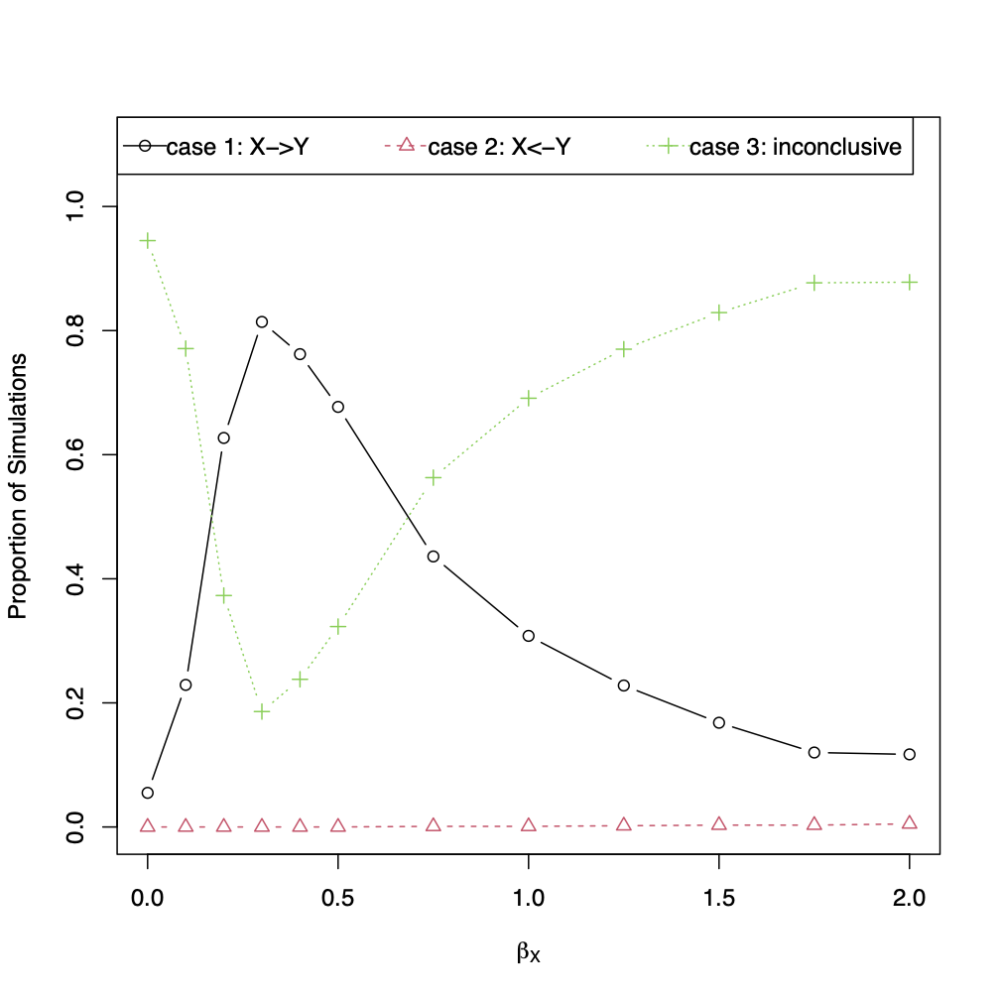

# reverseDirection
Examines the MR Steiger approach to detect the directionality between phenotype 1 X and phenotype 2 Y through simulation studies.

## Installation
```
install.packages("devtools")  # R v3.4 or higher is needed
install.packages("psych")

devtools::install_github("SharonLutz/reverseDirection")
```

## Input
First, the SNPs are generated from a binomial distribution for n subjects (input n) for a given vector of minor allele frequencies (input MAF).

For the SNPs G, the true phenotype 1(X<sub>true</sub>) is generated from a normal distribution with the variance (input varX) and the mean as follows:

E\[Xtrue \] = &gamma;<sub>o</sub> + &Sigma; &gamma;<sub>G</sub> G

All of these values are inputted by the user (i.e. the intercept gamma0, and the vector of genetic effect sizes gammaG). If there is no measurement error (input measurementError=F), then X=X<sub>true</sub>. If there is measurement error (input measurementError=T), then the measured phenotype 1 X is generated from the true phenotype 1 X<sub>true</sub> such that

E\[X \] = &delta;<sub>o</sub> +  &delta;<sub>X</sub> X<sub>true</sub>

where &delta;<sub>o</sub> and &delta;<sub>X</sub> are inputted by the user (input delta0, deltaX). Phenotype 2 Y is generated from a normal distribution with the variance (input varY) and the mean as follows:

E\[Y \] = &beta;<sub>o</sub> +  &beta;<sub>X</sub> X<sub>true</sub>

if there is no pleiotropy (input pleiotropy=F). If there is pleiotropy (input pleiotropy=T), then phenotype 2 is generated such that

E\[Y \] = &beta;<sub>o</sub> +  &beta;<sub>X</sub> X<sub>true</sub> + &Sigma; &beta;<sub>G</sub> G

All of these values are inputted by the user (i.e. the intercept beta0, the effect of phenotype 1 X<sub>true</sub> on phenotype 2 as  &beta;<sub>X</sub>, and the vector of the effect of the SNPs G directly on phenotype 2 as  &beta;<sub>G</sub>).

If there is unmeasured confounding (unmeasuredConfounding=T) between the exposure X and the outcome Y, then the unmeasured confounder U is generated from a normal distribution with user specified mean and variance (i.e. meanU, varU). Then, the exposure X and outcome Y are generated such that

E\[Xtrue \] = &gamma;<sub>o</sub> + &Sigma; &gamma;<sub>G</sub> G + &gamma;<sub>U</sub> U

E\[Y \] = &beta;<sub>o</sub> +  &beta;<sub>X</sub> X<sub>true</sub> + &beta;<sub>U</sub> U

For both unmeasured confounding and pleiotropy (input pleiotropy=T, unmeasuredConfounding=T), then phenotype 2 Y is generated such that

E\[Y \] = &beta;<sub>o</sub> +  &beta;<sub>X</sub> X<sub>true</sub> + &Sigma; &beta;<sub>G</sub> G + &beta;<sub>U</sub> U

After the SNP G, phenotype 1 X, and phenotype 2 Y are generated, then the reverseDirection function runs the MR Steiger approach to determine if the measured exposure X causes the outcome Y.

## Output
This function outputs the percent of simulations where the correct direction is detected between X and Y using the MR Steiger approach. The R functions outputs the percent of simulations where the 3 cases detailed in (Hemani et al., 2017) are detected:

#### case 1: X->Y if the p-value from the Steiger correlation is less than alpha and p-value from the MR approach is less than alpha and the Steiger correlation Z>0
#### case 2: X<-Y if the p-value from the Steiger correlation is less than alpha and p-value from the MR approach is less than alpha and the Steiger correlation Z<0
#### case 3: inconclusive if the p-value from the Steiger correlation is greater than alpha or the p-value from the MR approach is greater than alpha 

The percent of simulations where the p-value from the Steiger correlation and MR are less than alpha are outputted (Steiger and MR, respectively). The correlation between the first SNP G and X (corG1X), correlation between the first SNP G and Y (corG1Y), and the correlation between X and Y (corXY) are given.

## Example:
Consider an example with 100 subjects (input n=100) with a MAF of 50 (input MAF=0.5). Consider no pleiotropy, measurement error, or unmeasured counfouding (input measurementError = F, pleiotropy = F, unmeasuredConfounding=F). Then, let X be generated from a normal distribution with a variance of 1 (input varX = 1) and mean such that 
E\[X \] = 0 + 1 G
(input gamma0=0, gammaG=1). Y is generated from a normal distribution with a variance of 0.2 (input varY = 0.2) and mean such that 
E\[Y \] = 0 + &beta;<sub>X</sub> X 
(input beta0 = 0) and &beta;<sub>X</sub> varies from 0 to 2 (betaX = c(seq(from = 0, to = 0.5, by=0.1),seq(from = 0.75, to = 2, by=0.25))). The R code to run this example is given below.

```
library(reverseDirection)

results<-reverseDirection(nSim = 1000, n = 100, MAF = 0.5, 
gamma0 = 0, gammaG = 1, varX = 1, 
measurementError = F,  
beta0 = 0, betaX = c(seq(from = 0, to = 0.5, by=0.1),seq(from = 0.75, to = 2, by=0.25)), 
pleiotropy = F, unmeasuredConfounding=F, varY = 0.2, sig.level = 0.05, 
SEED = 1, plot.pdf = T, plot.name = "ReverseDirection")


round(results$matrix,2)
```

The function outputs the following matrix and plot where each row corresponds to &beta;<sub>X</sub> (input betaX). As seen below, mostly case 3 is detected, which means that the MR Steiger method is inconclusive as to whether the X causes Y.
```
      case1 case2 case3   Z+ Steiger   MR corGX corGY corXY
 [1,]  0.06     0  0.94 1.00    1.00 0.06  0.58 -0.01  0.00
 [2,]  0.23     0  0.77 1.00    0.98 0.24  0.58  0.13  0.22
 [3,]  0.63     0  0.37 1.00    0.95 0.68  0.58  0.24  0.41
 [4,]  0.81     0  0.19 1.00    0.90 0.92  0.57  0.32  0.56
 [5,]  0.76     0  0.24 1.00    0.78 0.98  0.57  0.38  0.67
 [6,]  0.68     0  0.32 0.99    0.68 1.00  0.57  0.43  0.75
 [7,]  0.44     0  0.56 0.97    0.44 1.00  0.58  0.50  0.86
 [8,]  0.31     0  0.69 0.92    0.31 1.00  0.58  0.53  0.91
 [9,]  0.23     0  0.77 0.88    0.23 1.00  0.58  0.54  0.94
[10,]  0.17     0  0.83 0.86    0.17 1.00  0.58  0.55  0.96
[11,]  0.12     0  0.88 0.81    0.12 1.00  0.57  0.56  0.97
[12,]  0.12     0  0.88 0.78    0.12 1.00  0.58  0.56  0.98
```



## Reference:
Hemani G, Tilling K, Davey Smith G (2017) Orienting the causal relationship between imprecisely measured traits using GWAS summary data. PLOS Genetics 13(11): e1007081.

